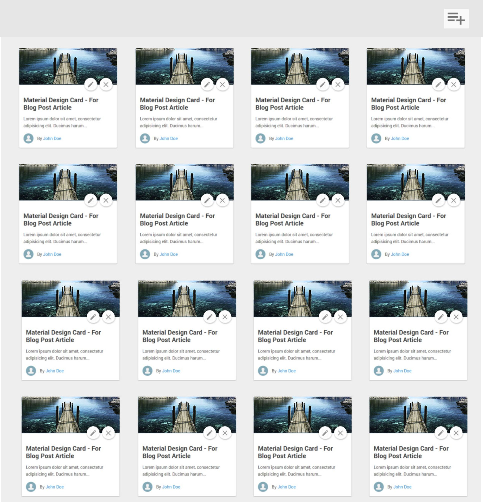

# Monte uma tela de cards com layout abaixo:
No topo da página um button que abre uma modal para inserir um novo post:
- Formulário com nome, titulo, descrição, imagem

No conteúdo da pagina:

- Lista com os cards

# Para o desenvolvimento:
- [Angular-cli](https://angular.io/docs/ts/latest/cli-quickstart.html)
- [Material2](https://material.angular.io/components)
- [Flex Layout](https://github.com/angular/flex-layout/wiki/API-Documentation)
- [In Memory API](https://github.com/angular/in-memory-web-api)
- [SASS](http://sass-lang.com/guide)
- HTML 5

# Padrões recomendados
- SASS
- - `Variables`, `Nesting`, `Partials`, `Import`, `Extend/Inheritance`, `Operators`, `Function` & `Mixin` 
- HTML
- - Nos padões `W3C`
- Formulários
- - Utilize `ReactiveForms` do próprio Angular.